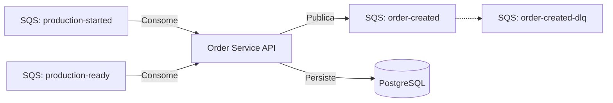

# ☁️ Guia de Provisionamento de Infraestrutura (Order Service)

Este documento detalha os recursos necessários na Cloud (AWS) para o funcionamento do microsserviço de Pedidos.

## 1. Banco de Dados (RDS)

- **Engine:** PostgreSQL (v15+)
- **Database Name:** `orders_db`
- **Segurança:** O Security Group deve permitir entrada na porta `5432` apenas vinda do Cluster EKS/ECS onde a aplicação roda.

## 2. Filas SQS (Mensageria)

A aplicação segue uma arquitetura orientada a eventos. É necessário criar as seguintes filas no SQS (Standard).

### A. Filas de Entrada (Consumers)

O `Order Service` precisa de permissão de leitura (`sqs:ReceiveMessage`, `sqs:DeleteMessage`) nestas filas:

| Nome da Fila         | Publicado por (Producer)    | Ação na Aplicação                                |
| :------------------- | :-------------------------- | :----------------------------------------------- |
| `production-started` | Serviço de Produção/Cozinha | Atualiza status do pedido para **Em Preparação** |
| `production-ready`   | Serviço de Produção/Cozinha | Atualiza status do pedido para **Pronto**        |

---

### B. Filas de Saída (Producers)

O `Order Service` precisa de permissão de escrita (`sqs:SendMessage`) nesta fila:

| Nome da Fila    | Consumido por        | Conteúdo                                    |
| :-------------- | :------------------- | :------------------------------------------ |
| `order-created` | Serviço de Pagamento | JSON com dados do pedido (Itens, Valor, ID) |

**⚠️ Configuração Crítica de Resiliência (DLQ):**

A fila `order-created` DEVE ser configurada com uma **Dead Letter Queue** para garantir que pedidos não processados não travem o sistema de pagamento.

**Configuração recomendada (Terraform/CloudFormation):**

1.  Criar fila morta: `order-created-dlq`
2.  Na fila principal `order-created`, configurar **Redrive Policy**:
    - `maxReceiveCount`: 3 (Após 3 tentativas falhas de consumo pelo Payment Service)
    - `deadLetterTargetArn`: ARN da `order-created-dlq`

## 3. Variáveis de Ambiente e Endpoint

A aplicação espera as URLs completas das filas nas variáveis de ambiente.

- **Diferença Local vs Cloud:**
  - **Local:** Usamos `localhost` ou `localstack` no endpoint.
  - **AWS:** As URLs são HTTPS padrão da AWS (ex: `https://sqs.us-east-1.amazonaws.com/...`).

## 4. Diagrama de Fluxo (Referência)

